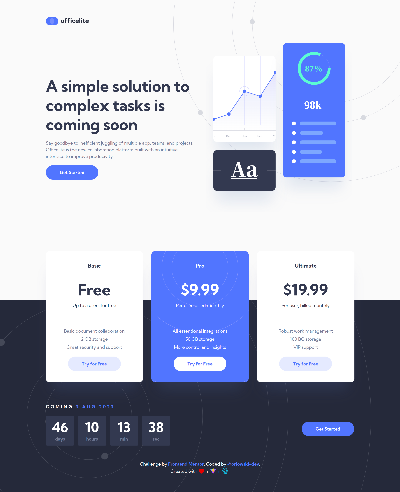
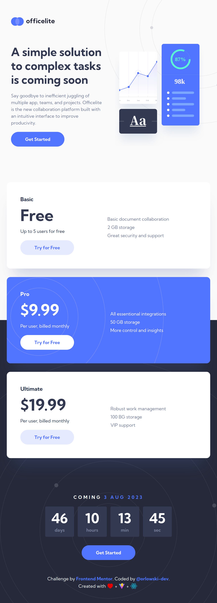
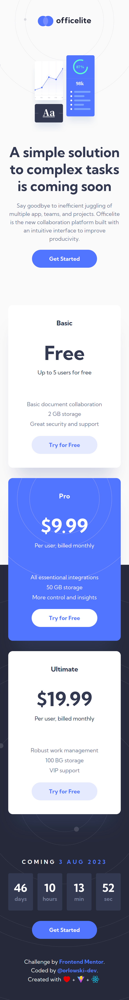
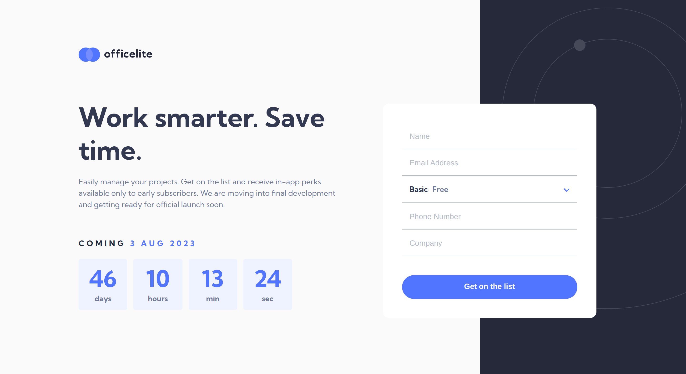
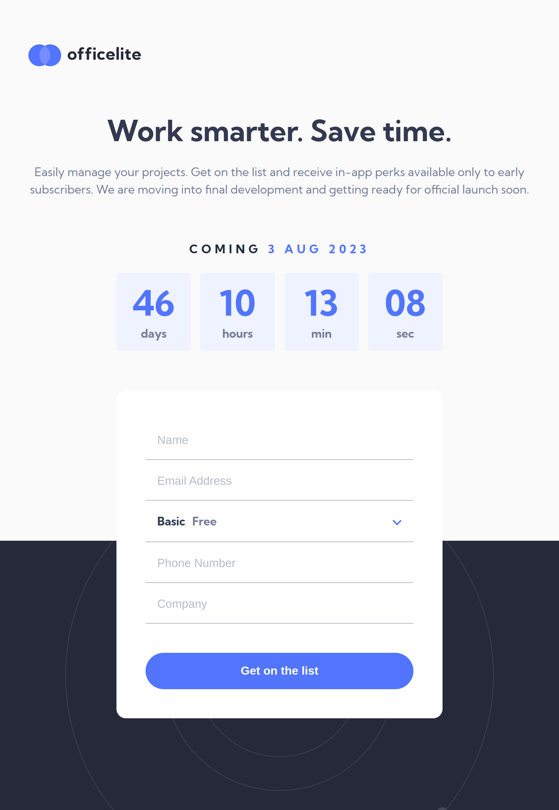
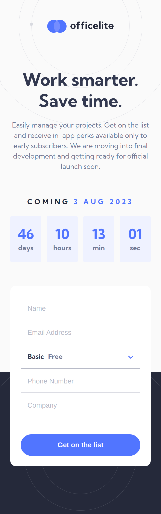
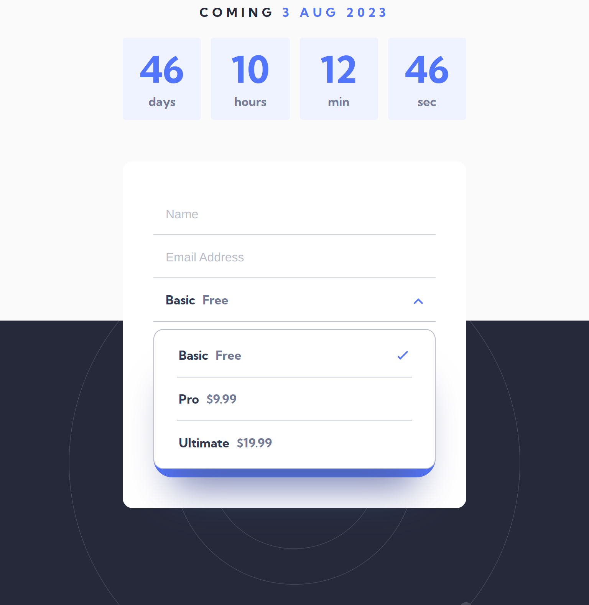

# Frontend Mentor - Officelite coming soon site solution

This is a solution to the [Officelite coming soon site challenge on Frontend Mentor](https://www.frontendmentor.io/challenges/officelite-coming-soon-site-M4DIPNz8g). Frontend Mentor challenges help you improve your coding skills by building realistic projects. 

## Table of contents

- [Overview](#overview)
  - [The challenge](#the-challenge)
  - [Screenshot](#screenshot)
  - [Links](#links)
- [My process](#my-process)
  - [Built with](#built-with)
  - [Useful resources](#useful-resources)
- [Author](#author)

## Overview

### The challenge

Users should be able to:

- View the optimal layout for the site depending on their device's screen size
- See hover states for all interactive elements on the page
- See error states when the contact form is submitted if:
  - The `Name` and/or `Email Address` fields are empty
  - The `Email Address` is not formatted correctly
- **Bonus**: See a live countdown timer that ticks down every second
- **Bonus**: See a custom-styled `select` form control in the sign-up form

### Screenshot

### Links

- Solution URL: [GitHub](https://github.com/orlowski-dev/fm-officelite-coming-soon)
- Live Site URL: [GitHub Pages](https://orlowski-dev.github.io/fm-officelite-coming-soon)

## My process

### Built with

- Semantic HTML5 markup
- CSS custom properties
- Flexbox
- CSS Grid
- Mobile-first workflow
- [React](https://reactjs.org/) - JS library
- [React Router DOM](https://reactrouter.com/en/main) - React routing module

### Useful resources

- [React built-in hooks](https://react.dev/reference/react)
- [React router dom tutorial](https://reactrouter.com/en/main/start/tutorial)

## Author

- Frontend Mentor - [@orlowski-dev](https://www.frontendmentor.io/profile/orlowski-dev)

